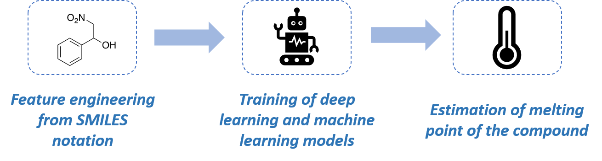

# Melting-point-predictor

⏳ WORK IN PROGRESS ⏳

The project aims to develop an advanced solution for estimating the melting point of organic compounds, a crucial characteristic in the field of organic chemistry. Accurate melting point determination is essential for compound characterization, with significant implications in various sectors of scientific research and industry, including the pharmaceutical and materials industries.

The estimator inputs a SMILES notation and outputs an estimated melting point.

To have more information about how this model was construct, please read the text above

## 1️⃣ Context

Interet du projet, bibliographie, peut-être une petite image ?

## 2️⃣ Data collection

## 3️⃣ Data visualization and data cleaning

Est-ce que j'ai des beaux graphiques a mettre ? si non, alors enlever "data vizualisation" du titre

## 4️⃣ Feature engineering and scaling

## 5️⃣ Find a model using machine learning and deep learning

### Baseline

Mettre belle image de la baseline et dire qu'on a utilisé RMSE et R² comme metriques

## 6️⃣ API

## 7️⃣ Create the website - Front end

Use the User Interface of [Melting Point Predictor project](https://github.com/lccopy/Melting-point-predictor-UI)

The User Interface was created using Flask.

Using this estimator is relatively straightforward. First, log on to the site and enter the SMILES rating of any compound, then click on "Estimate". You can use an existing compound, but it's also possible to test the application with a compound that hasn't yet been synthesized or listed.

Note that the melting point is an estimate, not an exact prediction.

The authors would like to point out that this application has been created independently and should not be used for commercial purposes.

## 8️⃣ Conclusion and future improvements

## Collaborators

PhD. Guillaume Bretel (Doctor of Chemistry, Data Scientist)

Luca Morel (Data Scientist, AI developer)
